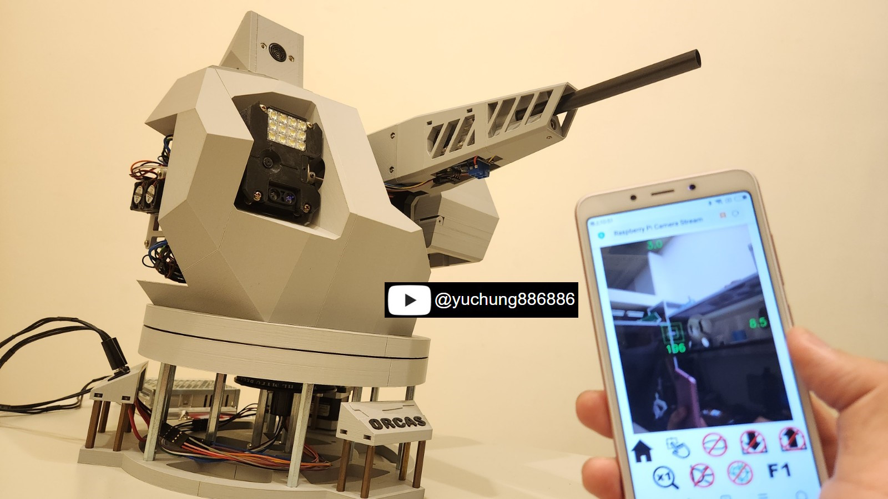
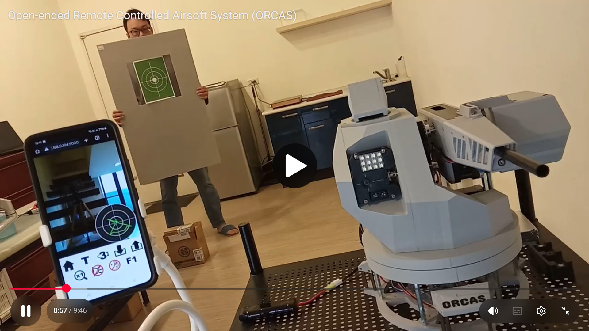

# Open-ended Remote Controlled Airsoft System (ORCAS)
  
This repository provides the firmware and software source code and hardware schematic for the ORCAS project. 

# Features demostration

- The ORCAS project implements a wirelessly controlled airsoft turret that can be controlled via the web browser on a mobile phone.
- The turret equips a airsoft AEG modified from Jinming Gen8 gel blaster gearbox and a laser head for zeroing.
- The turret fires 7-8mm gel balls, and its barrel assembly contains an LED board as a tracer, but it fails to light up the glowing gel balls as expected.
- The turret equips a LED board to provide illumination of the forward aiming view.
- The turret equips a infrared laser ranging sensor to measure the distance to the aimed target.
- The turret equips an ultrasonic rangefinder that acts as a radar to measure the distance between it and surrounding objects.
- Two NEMA 17 stepper motors driven by A4988 modules are used to implement the pan/tilt rotation of the turret.  
- Two 15BY micro stepper motors driven by A4988 modules are used to implement gel balls feeding and the radar rotation.
- The above electronic components are integrated and controlled by the STM32F103 MCU, which implement driver commands through the UART interface for integration with the upper-level MCUs or computer.
- The turret equips a Raspberry Pi camera module to provide a first-person view to navigate the turning of the turret.
- The turret equips a Raspberry Pi Zero 2 W board to run a static web server that provides a user interface for connected clients to stream images captured by the camera to the client and transmit control requests from the client to the MCU.
- The turret is powered by a 12V power supply and an extra airsoft battery.

# Hardware components
- The schematic of the turret is located in the Hardware/ folder of this repository.  
- All electronic units placed in the schematic are off-the-shelf modules that can be found and purchased on the web. You can find the part numbers of these modules in the tutorials that will be uploaded.

# Firmware binaries and the development environment
- The compiled firmware binaries are located in the Firmware/bins/ folder of this repository. STM32CubeProgrammer needs to be installed to flash the firmware binary file into the MCU, and the flashing process will be described in the tutorial that will be uploaded.
- The firmware source code package is located in the Firmware/ folder of this repository. These codes are developed in STM32CubeIDE environment, which needs to be installed if you want to modify the codes to compile your custom firmware.

# Software and Raspberry Pi OS
- The software source code package runs on the Raspberry Pi is located in the Software/ folder of this repository. How to use this software will be explained in the tutorial that will be uploaded.
- The tutorial will only give an overview of the installation and configuration of the Raspberry Pi OS to run the software. You will need to refer to the official Raspberry Pi documentation for detailed instructions.

# Mechanical components
- All the STL files of the 3D printed parts are NOT shared or open-source, and these files will be sold on Cults3D for private use only.
- Besides the 3D printed parts, there are also some off-the-shelf mechanical components used in this project and you can refer to the part names listed in the tutorial that will be uploaded. to search and purchase these parts on the web.

# Tutorial
- To be updated.
